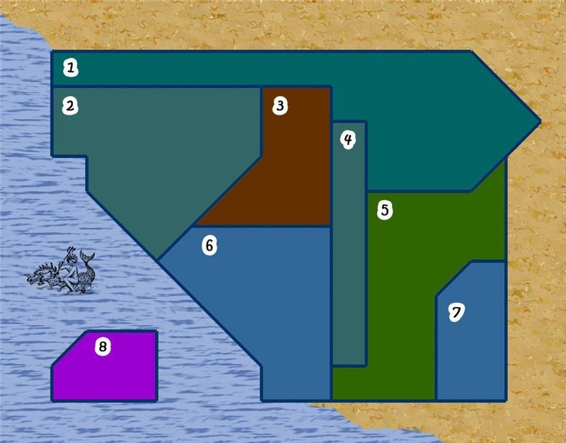

# Homework: City Simulation
## Details :
City Simulation
Develop a turn - based simulation of a modern city.
The city has 8 suburbs. One of these suburbs is located on an island.
The city employs a public transport system that facilitates the movement of civilians between suburbs that share "common borders".
However, for the island suburb, civilians utilize a ferry line that operates exclusively for the coastal suburbs.
Each suburb is home to a population of "Civilians", categorized into three main groups :
1. Workers
2. Teachers
3. Artist

--------------

- On each turn show latest data of suburbs and public transport activities.
- On each turn the city may randomly experience a natural disaster and the population must be evacuated to closet suburbs.

